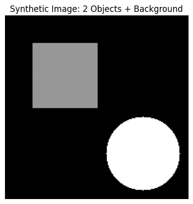
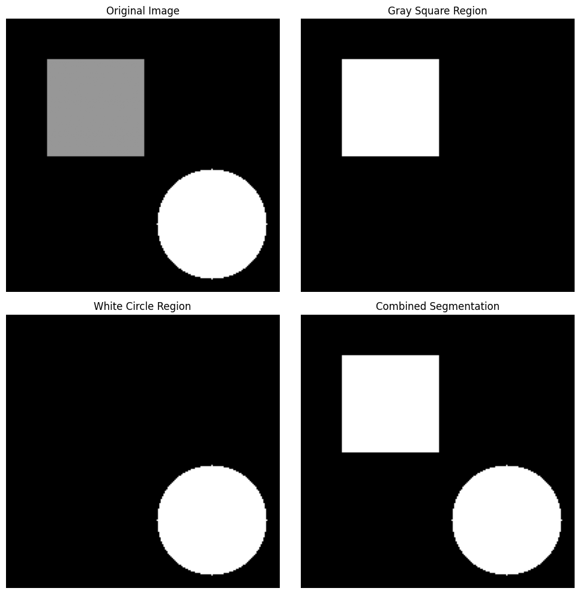

# EC7212 - Computer Vision and Image Processing

# Take Home Assignment 2

## Task 01

### ✅ Synthetic Image Creation
  

---

### ✅ Gaussian Noise Addition

### ✅ Otsu's Thresholding
  

---

## Task 02

This task implements a region-growing technique for image segmentation. The algorithm starts from seed points inside objects of interest and recursively adds neighboring pixels that fall within a predefined intensity range of the seed values.

#### ▶️ Key Concepts:

- **Seed Points**
Starting locations inside objects to begin region growth

- **Intensity Threshold**
Maximum allowed difference from seed pixel value

- **8-Connectivity**
Checks all 8 neighboring pixels (including diagonals)

- **Region Expansion**
Grows regions until no more similar pixels are found

### ✅ Synthetic Image Creation
  

---

### ✅ Region-Growing according different seeds
  

---
